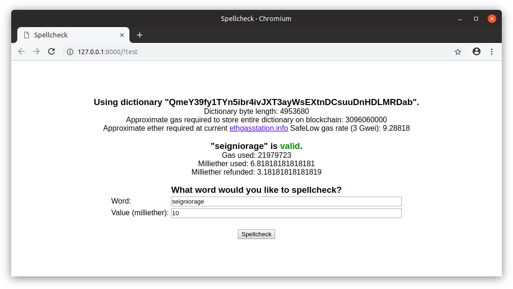
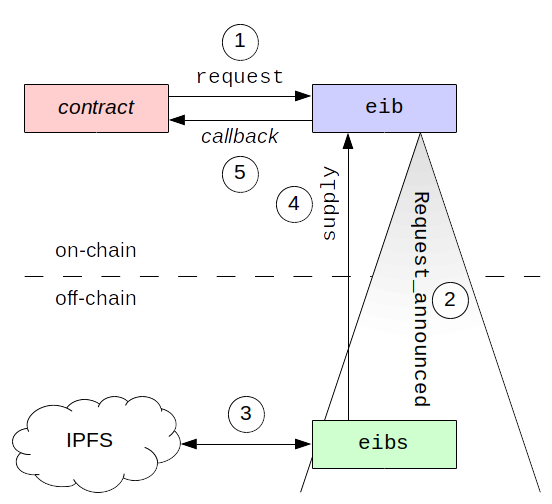

#  Ethereum Input Bus (alpha)

Samuel E. Moelius III (<sam@moeli.us>)

If EIB could be of use to your project, then please contact me (<sam@moeli.us>) and/or consider a
donation to 0xD07C0Bb4B0E5943cbeD93c337686217D91655a2e.

Contents
1. [Introduction](#user-content-introduction)
2. [Repository contents](#user-content-repository-contents)
3. [Quick start](#user-content-quick-start)
4. [How EIB works](#user-content-how-eib-works)
5. [Building](#user-content-building)
6. [Testing](#user-content-testing)
7. [Reporting bugs](#user-content-reporting-bugs)

## Introduction

Ethereum Input Bus (EIB) provides a means for moving data onto the Ethereum blockchain securely.

More specifically, EIB allows an Ethereum contract to crowd-source a read from the InterPlanetary File
System ([IPFS](https://ipfs.io/)), and for a respondent to supply the data and prove that the data is
correct, i.e., the data comes from the correct file, the data comes from the correct offset within that
file, and the data is of the correct length.

## Repository contents

The EIB repository consists of:

  * the [EIB contract](eib/README.md) itself (receives requests, verifies responses, etc.),

  * a [prototype EIB supplier](eibs/README.md) (`eibs`) implemented in TypeScript,

  * [example webapps](examples/README.md) written to use EIB, and

  * [utilities](util/README.md) for working with EIB.

## Quick start

At the top of the EIB repository, type the following.

    make
    cd examples/spellcheck
    make demo

**What is going on?**  The command `make demo` does essentially the following.

  * launch a test Ethereum blockchain ([`ganache-cli`](https://github.com/trufflesuite/ganache-cli))

  * deploy several contracts to the blockchain, including one called
    [`Spellcheck`](https://github.com/smoelius/ethereum_input_bus/blob/master/examples/spellcheck/contracts/Spellcheck.sol)

  * launch a webapp to interact with the `Spellcheck` contract

  * launch an instance of `eibs` to supply data to the contract

  * open the webapp in a browser

The `Spellcheck` contract does what its name suggests: it checks the validity of a word against a
dictionary.  However, the dictionary is not stored on the blockchain: at 4.8 megabytes, storing that
much data on the blockchain would be rather expensive.  Instead, the dictionary is stored off-chain;
when the `Spellcheck` contract needs data from the dictionary, the data is obtained using EIB.

## How EIB works

  * (1) A contract requests data from `eib` by calling `request`.

  * (2) `eib` emits a `Request_announced` event.

  * (3) A supplier (e.g., `eibs`) notices the event and obtains the relevant file from IPFS.

  * (4) The supplier extracts the requested data and sends it to `eib` by calling `supply`.

  * (5) `eib` verifies the data (see below) and notifies the requesting contract via a callback.

The call to `request` includes the root of a [Merkle tree](https://en.wikipedia.org/wiki/Merkle_tree)
whose leaves hold the contents of the IPFS file.  Along with the data, the supplier must send the
combined paths from the relevant leaves of this tree to its root.  In this way, the supplier *proves*
that the data is correct.  Put another way, this requirement ensures that `eib` is not fooled by a
cheating supplier who sends bogus data.

The call to `request` also includes the amount of Ether that the requestor is willing to pay for the
read.  The supplier uses some fraction of this Ether to pay for the gas needed to verify the Merkle
proof and for the requestor's callback.  The supplier keeps the remaining fraction as profit.  `eib`
does **not** keep any fraction of this Ether for itself.

A requestor can cancel its request at any time before the data has been supplied.

## Building

One should be able to build EIB by simply typing `make`.

Alternatively, one can type `make full`.  In addition to building EIB, `make full` runs all post-build
checks and all tests.  Warning: On my laptop, `make full` currently takes about 12 minutes.

## Testing

EIB can be tested in two ways:

  * with the testing framework itself responding to requests (useful for testing the EIB contract
    itself) or

  * with `eibs` responding to requests (useful for testing `eibs`).

Details are given in the EIB contract's [README](eib/README.md) and in `eibs`'
[README](eibs/README.md), respectively.

## Reporting bugs

Please send bug reports to Samuel E. Moelius III (sam@moeli.us).

